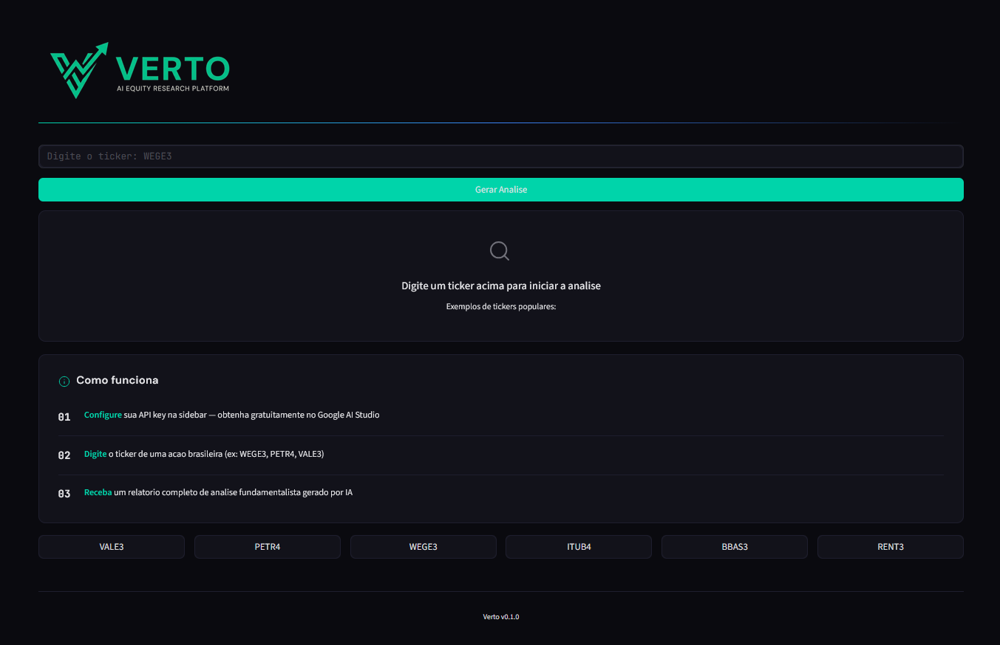
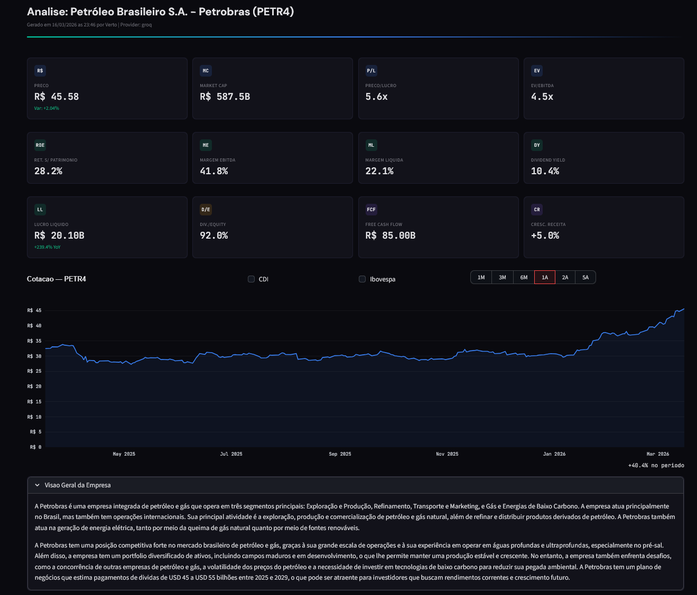
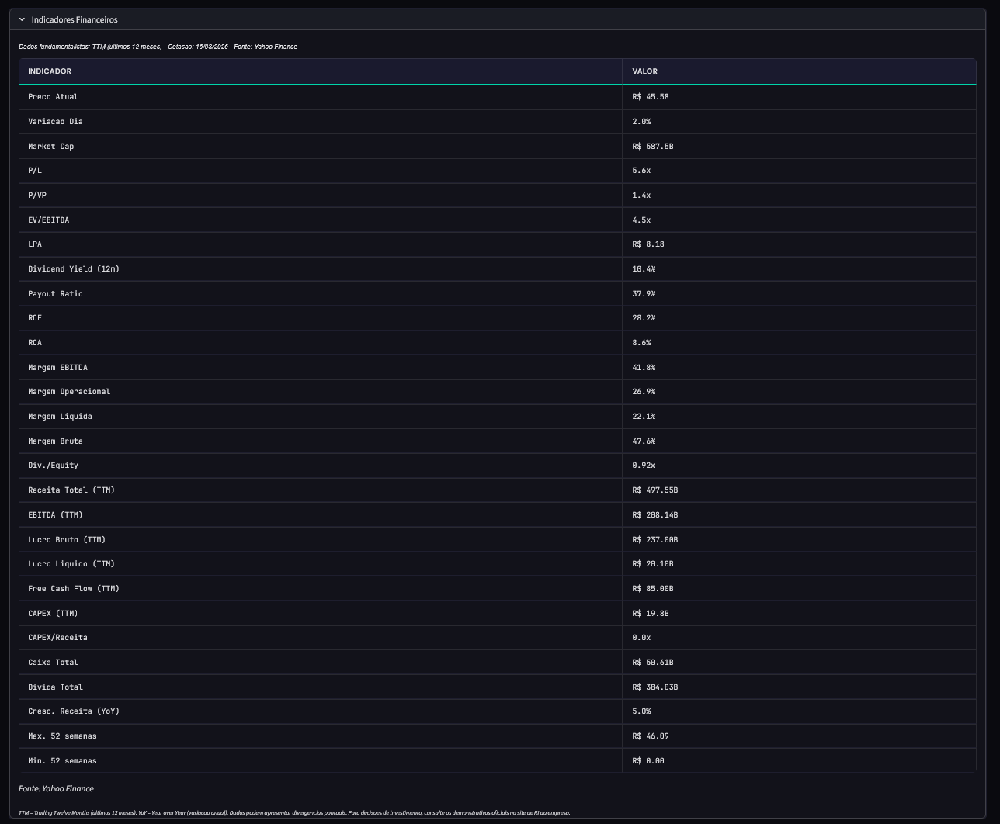
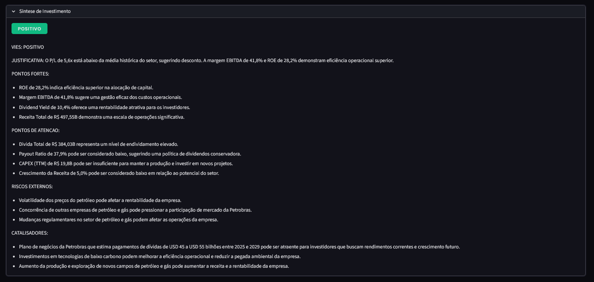

# Verto

**AI-Powered Stock Research Agent** para acoes brasileiras (B3).

> Documentacao tecnica: [ARCHITECTURE.md](ARCHITECTURE.md)

---

### Tela inicial



### Cards de indicadores + grafico de cotacao



### Tabela de indicadores fundamentalistas (TTM)



### Sintese de investimento gerada por IA



---

## Instalacao Rapida

**Pre-requisitos:** Python 3.10+ e uma API key gratuita do [Gemini](https://aistudio.google.com/apikey) ou [Groq](https://console.groq.com/keys).

### Windows (2 cliques)

1. Baixe o projeto e execute **`setup.bat`** (instala tudo automaticamente)
2. Edite o arquivo `.env` e cole sua API key
3. Execute **`start.bat`** para iniciar

### Mac / Linux

```bash
git clone https://github.com/Eduardolmbg/Verto.git
cd Verto
./setup.sh       # instala tudo
nano .env        # cole sua API key
./start.sh       # inicia o app
```

### Manual

```bash
git clone https://github.com/Eduardolmbg/Verto.git
cd Verto
python -m venv .verto
source .verto/bin/activate   # Windows: .verto\Scripts\activate
pip install -r requirements.txt
cp .env.example .env       # Windows: copy .env.example .env
# Edite .env e preencha sua API key
streamlit run app.py
```

Acesse `http://localhost:8501`, configure o provider na sidebar, digite um ticker e clique em **Gerar Analise**.

## Licenca

MIT
